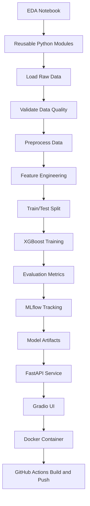

# From Notebook Experiment to Production-Grade ML System: Building a Telco Customer Churn Prediction Platform

Machine learning projects often start with a simple question:

Can we use historical customer data to predict which customers are likely to churn?

In a notebook, this question is easy to explore. We load the dataset, clean a few columns, run some visualizations, train a model, and check the metrics. But the moment we want another developer, recruiter, founder, or engineering team to trust the work, the notebook is no longer enough.

A production-grade ML project needs structure. It needs repeatability. It needs validation, tracking, serving, deployment, and documentation. Most importantly, it needs to show that the person building it understands not only model accuracy, but also the engineering discipline required to ship machine learning systems.

This project started as a local Telco Customer Churn notebook and was converted into a systematic ML engineering project with modular code, data validation, MLflow tracking, FastAPI serving, a Gradio UI, Docker packaging, and GitHub Actions automation.

---

## Where Local ML Projects Usually Fail

Most beginner-to-intermediate ML projects work only inside the developer's machine.

They usually fail for predictable reasons:

- The preprocessing logic exists only inside a notebook.
- The model cannot be retrained from a clean command.
- There is no clear separation between data loading, cleaning, feature engineering, training, evaluation, and serving.
- Data quality assumptions are not validated.
- The feature transformation used during training is not guaranteed to match the feature transformation used during inference.
- Model parameters and metrics are manually written down or forgotten.
- The trained model is saved somewhere without reproducible metadata.
- The API layer is treated as an afterthought.
- Deployment commands are missing or inconsistent.
- There is no CI/CD workflow.

That is the difference between "I trained a model" and "I built an ML system."

The goal of this project was to cross that gap.

---

## Project Goal

The business problem is customer churn prediction for a telecom company.

Customer churn matters because acquiring new customers is usually more expensive than retaining existing ones. If a company can identify high-risk customers early, it can trigger retention actions such as offers, support outreach, plan recommendations, or account review.

The technical goal was to build a system that:

- Accepts raw Telco customer data
- Validates whether the data is usable
- Cleans and transforms it consistently
- Trains a machine learning model
- Tracks metrics and artifacts
- Serves predictions through an API
- Provides a browser-based UI
- Runs inside Docker
- Supports automated Docker image delivery through GitHub Actions

The final project demonstrates not only modeling ability, but ML engineering maturity.

---

## High-Level Architecture

The project is structured around clear ownership boundaries.

```text
notebooks/       -> exploration and early analysis
src/data/        -> loading and preprocessing
src/features/    -> feature engineering
src/utils/       -> validation and helper logic
src/models/      -> model training and evaluation helpers
src/serving/     -> inference-time model loading and prediction
src/app/         -> FastAPI and Gradio application
scripts/         -> runnable pipeline entrypoints
.github/         -> CI/CD workflow
dockerfile       -> container image definition
```

This structure makes the system easier to reason about. Each module has a job, and each stage can be tested or improved independently.

The full lifecycle looks like this:



---

## Step 1: Starting With EDA

The project begins in `notebooks/EDA.ipynb`.

The notebook phase is useful for understanding:

- Dataset shape
- Missing values
- Categorical columns
- Numeric distributions
- Target class balance
- Relationships between contract type, monthly charges, tenure, and churn
- Initial modeling direction

But the notebook is intentionally not the final product.

The important decision was to treat the notebook as a discovery tool, then move the repeatable logic into Python modules. This is how production ML projects should evolve: exploration first, then modularization.

---

## Step 2: Modular Data Loading

Data loading is handled in `src/data/load_data.py`.

The function keeps the responsibility simple:

- Receive a file path
- Check whether the file exists
- Load the CSV into a DataFrame
- Fail clearly if the input is invalid

This may look small, but it matters. A production pipeline should fail early and clearly. Silent failures or hidden notebook assumptions are expensive in real systems.

---

## Step 3: Data Validation Before Training

One of the most important upgrades in this project is the validation layer.

The project uses Great Expectations in `src/utils/validate_data.py` to validate the raw dataset before preprocessing and training.

Validation includes:

- Required column checks
- Null checks on critical fields
- Valid category checks
- Numeric range checks
- Business logic checks

Examples:

- `gender` must be either `Male` or `Female`
- `Contract` must be one of `Month-to-month`, `One year`, or `Two year`
- `InternetService` must be one of `DSL`, `Fiber optic`, or `No`
- `tenure` must be non-negative and within a reasonable upper bound
- `MonthlyCharges` and `TotalCharges` must be non-negative
- `TotalCharges` should generally be greater than or equal to `MonthlyCharges`

This is a production mindset: do not train a model on data that has not passed quality checks.

If validation fails, the pipeline logs failed expectations and stops. That protects the model from corrupted or unexpected data.

---

## Step 4: Preprocessing as a Reusable Module

Preprocessing lives in `src/data/preprocess.py`.

The preprocessing stage handles:

- Trimming column names
- Removing customer ID columns
- Mapping the target column `Churn` from `Yes`/`No` to `1`/`0`
- Converting `TotalCharges` to numeric
- Filling missing numeric values
- Keeping the dataset consistent before feature engineering

Removing ID columns is especially important. Customer identifiers should not become model signals. Keeping them can create leakage or useless memorization.

This stage makes the input predictable before the model-specific transformation begins.

---

## Step 5: Deterministic Feature Engineering

Feature engineering is implemented in `src/features/build_features.py`.

This is where the raw cleaned data becomes model-ready data.

The system handles:

- Binary categorical variables
- Multi-category variables
- Boolean columns
- Numeric features
- Final model-compatible feature format

Binary variables are mapped deterministically:

```text
No     -> 0
Yes    -> 1
Female -> 0
Male   -> 1
```

Multi-category features are one-hot encoded using `pandas.get_dummies`.

This matters because inconsistent feature engineering is one of the biggest causes of ML system bugs. If training and serving do not produce the same feature columns in the same order, predictions become unreliable.

To avoid that, the pipeline saves the final feature column list and reuses it during serving.

---

## Step 6: Training the XGBoost Model

The main training pipeline lives in `scripts/run_pipeline.py`.

The pipeline runs:

```text
Load -> Validate -> Preprocess -> Feature Engineering -> Split -> Train -> Evaluate -> Log
```

The model used is XGBoost, which is a strong baseline for structured tabular data.

The training design includes:

- Stratified train/test split
- Fixed random seed for reproducibility
- Class imbalance handling using `scale_pos_weight`
- Tuned parameters from experimentation
- Threshold-based classification

Customer churn is usually imbalanced because fewer customers churn than stay. If the model ignores that imbalance, it may predict "not churn" too often and still look accurate. That is why this project focuses on metrics such as recall, precision, F1 score, and ROC AUC instead of accuracy alone.

For churn prediction, recall is especially important because missing a likely churner can mean losing revenue.

---

## Step 7: MLflow for Experiment Tracking

MLflow is integrated into the pipeline to track the model lifecycle.

The pipeline logs:

- Model type
- Classification threshold
- Test split size
- Data validation status
- Training time
- Prediction time
- Precision
- Recall
- F1 score
- ROC AUC
- Feature column list
- Preprocessing artifact
- Trained model artifact

This gives the project reproducibility.

Without experiment tracking, it is difficult to answer basic engineering questions:

- Which parameters produced this model?
- What metrics did it achieve?
- Which feature columns were used?
- Was the data validation successful?
- Where is the trained artifact?

MLflow provides those answers.

Run MLflow locally:

```bash
mlflow ui --backend-store-uri ./mlruns
```

Then open:

```text
http://localhost:5000
```

---

## Step 8: Inference Layer

The inference logic is implemented in `src/serving/inference.py`.

This layer is responsible for:

- Loading the trained model artifact
- Loading the feature column list
- Accepting a single customer record
- Applying serving-time transformations
- Reindexing the input to the exact training feature order
- Returning a human-readable prediction

The model loader supports different environments:

- Docker path: `/app/model`
- Bundled repository path: `src/serving/model/...`
- Local MLflow run artifacts: `mlruns/...`

This flexibility makes the project easier to run locally and inside a container.

The serving path is designed to reduce training-serving skew. Even if a request is missing some one-hot encoded columns, the feature matrix is reindexed against the saved feature list with missing values filled as zero.

---

## Step 9: FastAPI API Layer

The API is implemented in `src/app/main.py`.

FastAPI provides:

- Request validation using Pydantic
- REST endpoint for predictions
- Auto-generated Swagger docs
- A clean interface for external systems

Available endpoints:

```text
GET  /
POST /predict
GET  /docs
GET  /ui
```

The prediction API accepts customer information in JSON format and returns a churn prediction.

Example:

```bash
curl -X POST "http://localhost:8000/predict" \
  -H "Content-Type: application/json" \
  -d '{
    "gender": "Female",
    "Partner": "No",
    "Dependents": "No",
    "PhoneService": "Yes",
    "MultipleLines": "No",
    "InternetService": "Fiber optic",
    "OnlineSecurity": "No",
    "OnlineBackup": "No",
    "DeviceProtection": "No",
    "TechSupport": "No",
    "StreamingTV": "Yes",
    "StreamingMovies": "Yes",
    "Contract": "Month-to-month",
    "PaperlessBilling": "Yes",
    "PaymentMethod": "Electronic check",
    "tenure": 1,
    "MonthlyCharges": 85.0,
    "TotalCharges": 85.0
  }'
```

Example response:

```json
{
  "prediction": "Likely to churn"
}
```

---

## Step 10: Gradio UI for Business Users

The project also includes a Gradio UI mounted inside the FastAPI app at:

```text
http://localhost:8000/ui
```

This makes the model usable without Postman or curl.

The UI allows users to enter:

- Customer profile information
- Service details
- Contract and billing information
- Tenure
- Monthly charges
- Total charges

It also includes sample high-risk and low-risk customer profiles.

This is valuable because ML systems often need two interfaces:

- API for developers and applications
- UI for business users and demonstrations

---

## Step 11: Dockerization

The project is containerized using `dockerfile`.

The Docker image:

- Uses a lightweight Python base image
- Sets `/app` as the working directory
- Installs dependencies from `requirements.txt`
- Copies the project source code
- Copies required model artifacts
- Sets `PYTHONPATH`
- Exposes port `8000`
- Runs the FastAPI app with Uvicorn

Build the image:

```bash
docker build -f dockerfile -t telecom-churn-api:latest .
```

Run the container:

```bash
docker run --name telecom-churn-api -p 8000:8000 telecom-churn-api:latest
```

Open:

```text
http://localhost:8000
http://localhost:8000/docs
http://localhost:8000/ui
```

If the container name already exists:

```bash
docker stop telecom-churn-api
docker rm telecom-churn-api
docker run --name telecom-churn-api -p 8000:8000 telecom-churn-api:latest
```

This converts the project from "runs on my machine" to "runs anywhere Docker is available."

---

## Step 12: GitHub Actions CI/CD

The repository includes a GitHub Actions workflow in `.github/workflows/ci.yml`.

The workflow runs on pushes to `main` and:

- Checks out the code
- Sets up Docker Buildx
- Logs in to Docker Hub
- Builds the Docker image
- Pushes the image to Docker Hub

Required repository secrets:

```text
DOCKERHUB_USERNAME
DOCKERHUB_TOKEN
```

This is the beginning of a CI/CD workflow. In a larger production environment, I would extend it with:

- Unit tests
- Linting
- Security checks
- Model quality gates
- Image vulnerability scanning
- Deployment to a cloud runtime

But even in its current state, the system has a real automated delivery path for the container image.

---

## What This Project Improves Compared to Typical ML Repositories

Many ML repositories only show the final model. This project shows the system around the model.

It improves over typical local ML projects by adding:

- Clear project structure
- Reusable Python modules
- Data validation
- Experiment tracking
- Artifact management
- API serving
- UI serving
- Docker packaging
- CI/CD workflow
- Developer-focused README documentation

This is the kind of structure expected in product-based engineering teams, where code must be understandable, repeatable, and maintainable by other developers.

---

## Important Edge Cases Considered

The system includes handling for practical edge cases:

- Missing dataset path
- Invalid raw values
- Missing or malformed `TotalCharges`
- Unnecessary customer ID leakage
- Class imbalance in churn prediction
- Boolean values incompatible with XGBoost
- Feature column mismatch between training and serving
- Different model artifact paths in local and Docker environments
- Existing Docker container name conflicts

These details matter because production bugs often come from small assumptions that were never made explicit.

---

## What I Would Improve Next

The next engineering improvements would be:

- Add proper unit tests under `tests/`
- Add test execution to GitHub Actions
- Add code formatting and linting checks
- Add model performance gates before Docker push
- Add MLflow Model Registry promotion workflow
- Add data drift monitoring
- Add structured logs for prediction requests
- Add request latency metrics
- Add cloud deployment configuration
- Add batch prediction support
- Add monitoring dashboards

These are the natural next steps from a portfolio-grade system toward a more complete production platform.

---

## Final Reflection

This project is not just about predicting churn.

It is about showing how I think as an ML engineer.

I started with exploration, identified the modeling path, then converted the workflow into a modular system. I added validation so bad data does not silently enter training. I added MLflow so experiments are traceable. I added serving so the model can be consumed. I added Docker so the app can run outside my local machine. I added GitHub Actions so delivery can be automated. Finally, I documented the complete workflow so another developer can understand, run, and extend the system.

That is the difference between building a model and engineering a machine learning product.

