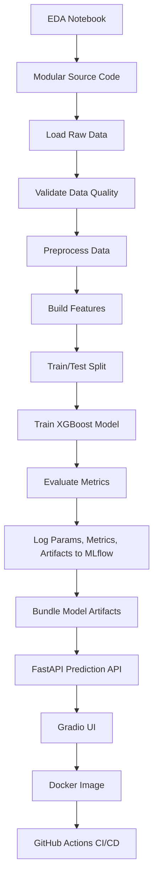
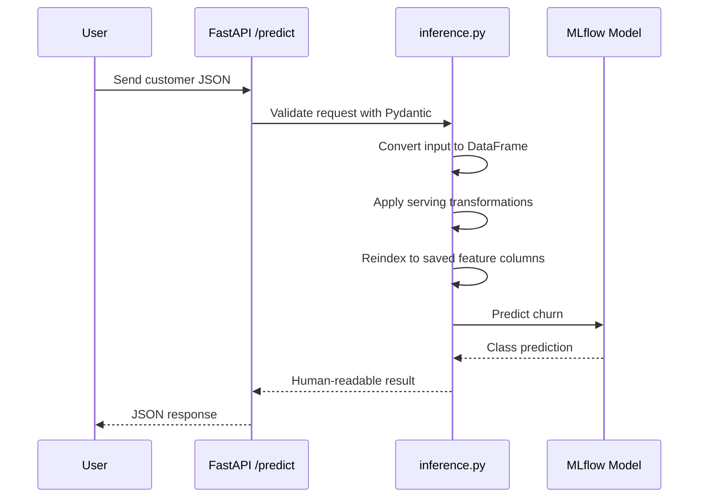

# Telco Customer Churn Prediction System

Production-style machine learning system for predicting telecom customer churn, built from exploratory notebooks and converted into a modular, testable, trackable, containerized, and CI/CD-ready project.

This repository is not only a model training notebook. It is an end-to-end ML engineering project that shows how a local experiment can be converted into a structured system with data validation, reproducible feature engineering, MLflow experiment tracking, FastAPI serving, Gradio UI, Docker packaging, and GitHub Actions automation.

---

## Why This Project Exists

Most local ML projects fail when they move beyond notebooks.

Common failure points:

- Data cleaning logic stays hidden inside notebooks and cannot be reused during serving.
- Training and inference use slightly different preprocessing, causing training-serving skew.
- Experiments are not tracked, so model performance cannot be reproduced or compared.
- Data quality assumptions are not validated before training.
- Model artifacts are saved manually without clear metadata.
- APIs are created after the model is built, instead of being designed as part of the system.
- Deployment steps are undocumented and hard to repeat.
- CI/CD is missing, so every change depends on manual testing.

This project solves those gaps by converting the notebook workflow into a production-grade ML project structure.

The final system supports:

- Modular pipeline execution from raw data to trained model
- Great Expectations based data validation
- Deterministic preprocessing and feature engineering
- XGBoost model training with class imbalance handling
- MLflow tracking for parameters, metrics, models, and artifacts
- FastAPI REST serving
- Gradio browser UI
- Dockerized deployment
- GitHub Actions workflow for Docker image build and push

---

## Project Architecture

```text
Telecom_custmor_churn_model/
├── .github/
│   └── workflows/
│       └── ci.yml                         # GitHub Actions Docker build/push workflow
├── data/
│   ├── raw/                               # Raw Telco dataset, ignored from Docker context
│   └── processed/                         # Generated processed data
├── notebooks/
│   └── EDA.ipynb                          # Exploration and early analysis
├── scripts/
│   ├── run_pipeline.py                    # Main end-to-end training pipeline
│   ├── prepare_processed_data.py          # Data preparation utility
│   ├── test_pipeline_phase1_data_features.py
│   └── test_pipeline_phase2_modeling.py
├── src/
│   ├── app/
│   │   ├── main.py                        # FastAPI app + mounted Gradio UI
│   │   └── app.py                         # Compatibility wrapper
│   ├── data/
│   │   ├── load_data.py                   # CSV loading with file checks
│   │   └── preprocess.py                  # Cleaning and type handling
│   ├── features/
│   │   └── build_features.py              # Deterministic feature engineering
│   ├── models/
│   │   ├── train.py                       # Model training helper
│   │   ├── evaluate.py                    # Evaluation helper
│   │   └── tune.py                        # Tuning support
│   ├── serving/
│   │   ├── inference.py                   # Production inference logic
│   │   └── model/                         # Bundled MLflow model artifacts
│   └── utils/
│       ├── validate_data.py               # Great Expectations validation
│       └── utils.py
├── .dockerignore
├── dockerfile
├── requirements.txt
└── README.md
```

---

## System Workflow



---

## ML Pipeline Design

The main pipeline is implemented in `scripts/run_pipeline.py`.

It runs the complete ML lifecycle:

```text
Raw CSV
  -> Load
  -> Validate
  -> Preprocess
  -> Feature Engineering
  -> Train/Test Split
  -> Train XGBoost
  -> Evaluate
  -> Log to MLflow
  -> Save Serving Artifacts
```

### 1. Data Loading

Implemented in `src/data/load_data.py`.

Responsibilities:

- Accept a CSV path
- Check whether the file exists
- Load data into a Pandas DataFrame
- Fail early with a clear error if the file is missing

This keeps raw data access separate from cleaning, modeling, and serving logic.

### 2. Data Validation

Implemented in `src/utils/validate_data.py`.

The project uses Great Expectations to validate the dataset before training. This is important because bad data should fail before it reaches the model.

Validation checks include:

- Required columns such as `customerID`, `gender`, `Contract`, `tenure`, `MonthlyCharges`, and `TotalCharges`
- Valid category values for fields like `gender`, `Partner`, `PhoneService`, `Contract`, and `InternetService`
- Numeric ranges for tenure and charges
- Null checks on critical features
- Business consistency checks such as `TotalCharges >= MonthlyCharges` for most customers

If validation fails, the pipeline logs the failed expectations to MLflow and stops training.

### 3. Preprocessing

Implemented in `src/data/preprocess.py`.

Preprocessing handles:

- Column name cleanup
- Customer identifier removal
- Target conversion from `Yes`/`No` to `1`/`0`
- `TotalCharges` conversion from object/string to numeric
- Numeric missing value imputation
- Basic type consistency

This makes the dataset predictable before feature engineering begins.

### 4. Feature Engineering

Implemented in `src/features/build_features.py`.

Feature engineering is deterministic and designed to reduce training-serving skew.

The feature builder:

- Detects binary categorical columns
- Applies stable binary mappings:
  - `No -> 0`, `Yes -> 1`
  - `Female -> 0`, `Male -> 1`
- Applies one-hot encoding for multi-category features
- Converts boolean columns to integers for XGBoost compatibility
- Produces a model-ready feature table

The generated feature column order is saved and reused during serving.

### 5. Model Training

The main pipeline trains an XGBoost classifier.

Key training choices:

- Stratified train/test split for class balance
- Fixed random seed for reproducibility
- `scale_pos_weight` to handle churn class imbalance
- Tuned model parameters from experimentation
- Threshold-based classification to improve churn detection sensitivity

The model is evaluated using:

- Precision
- Recall
- F1 score
- ROC AUC
- Training time
- Prediction time

---

## MLflow Experiment Tracking

MLflow is used to track the training lifecycle.

The pipeline logs:

- Model type
- Classification threshold
- Test size
- Data quality pass/fail status
- Training time
- Prediction time
- Precision
- Recall
- F1 score
- ROC AUC
- Feature column list
- Preprocessing artifact
- Trained model artifact

This gives the project reproducibility and auditability. A future developer can inspect what model was trained, with which parameters, and what metrics it achieved.

Run the MLflow UI:

```bash
mlflow ui --backend-store-uri ./mlruns
```

Then open:

```text
http://localhost:5000
```

---

## Serving Architecture

The serving layer is implemented in:

- `src/serving/inference.py`
- `src/app/main.py`

The API uses FastAPI and exposes:

- `GET /` health/status endpoint
- `POST /predict` prediction endpoint
- `/docs` interactive Swagger documentation
- `/ui` Gradio web UI

### Serving Flow



The inference code searches for model artifacts in a production-friendly order:

1. `/app/model` inside Docker
2. Bundled model artifacts under `src/serving/model`
3. Local MLflow run artifacts under `mlruns`

This makes the app work in both local development and containerized deployment.

---

## Edge Cases Handled

This project handles several practical ML system edge cases:

- Missing input CSV path fails with a clear error.
- Invalid raw data fails during validation before model training.
- `TotalCharges` values are converted safely from strings to numeric values.
- Numeric missing values are imputed.
- Customer ID columns are removed to avoid leakage.
- Target values are mapped consistently to `0` and `1`.
- Binary categorical mappings are deterministic.
- Unknown or missing categorical values during serving do not crash the feature matrix.
- Boolean columns are converted to integers before XGBoost training.
- Serving data is reindexed to the exact feature order used during training.
- Model loading supports both local and Docker artifact layouts.
- Docker ignores unnecessary local files such as virtual environments, notebooks, data, and MLflow run directories.

---

## API Contract

### Health Check

```bash
curl http://localhost:8000/
```

Expected response:

```json
{
  "status": "ok"
}
```

### Prediction Request

```bash
curl -X POST "http://localhost:8000/predict" \
  -H "Content-Type: application/json" \
  -d '{
    "gender": "Female",
    "Partner": "No",
    "Dependents": "No",
    "PhoneService": "Yes",
    "MultipleLines": "No",
    "InternetService": "Fiber optic",
    "OnlineSecurity": "No",
    "OnlineBackup": "No",
    "DeviceProtection": "No",
    "TechSupport": "No",
    "StreamingTV": "Yes",
    "StreamingMovies": "Yes",
    "Contract": "Month-to-month",
    "PaperlessBilling": "Yes",
    "PaymentMethod": "Electronic check",
    "tenure": 1,
    "MonthlyCharges": 85.0,
    "TotalCharges": 85.0
  }'
```

Example response:

```json
{
  "prediction": "Likely to churn"
}
```

---

## Local Setup

### 1. Clone Repository

```bash
git clone https://github.com/ganeshtadiboina/telco-customer-churn-proj.git
cd telco-customer-churn-proj
```

### 2. Create Virtual Environment

```bash
python -m venv venv
source venv/bin/activate
```

On Windows:

```bash
venv\Scripts\activate
```

### 3. Install Dependencies

```bash
pip install --upgrade pip
pip install -r requirements.txt
```

### 4. Run Training Pipeline

Place the raw Telco dataset at:

```text
data/raw/Telco-Customer-Churn.csv
```

Then run:

```bash
python scripts/run_pipeline.py \
  --input data/raw/Telco-Customer-Churn.csv \
  --target Churn
```

Optional arguments:

```bash
python scripts/run_pipeline.py \
  --input data/raw/Telco-Customer-Churn.csv \
  --target Churn \
  --threshold 0.35 \
  --test_size 0.2 \
  --experiment "Telco Churn"
```

### 5. Run API Locally

```bash
uvicorn src.app.main:app --host 0.0.0.0 --port 8000
```

Open:

```text
http://localhost:8000/docs
http://localhost:8000/ui
```

---

## Docker Usage

Build the image:

```bash
docker build -f dockerfile -t telecom-churn-api:latest .
```

Run the container:

```bash
docker run --name telecom-churn-api -p 8000:8000 telecom-churn-api:latest
```

Open:

```text
http://localhost:8000
http://localhost:8000/docs
http://localhost:8000/ui
```

If a container with the same name already exists:

```bash
docker stop telecom-churn-api
docker rm telecom-churn-api
docker run --name telecom-churn-api -p 8000:8000 telecom-churn-api:latest
```

Or run with a different name:

```bash
docker run --name telecom-churn-api-v2 -p 8000:8000 telecom-churn-api:latest
```

Check logs:

```bash
docker logs telecom-churn-api
```

Stop and remove:

```bash
docker stop telecom-churn-api
docker rm telecom-churn-api
```

---

## GitHub Actions CI/CD

The workflow lives in:

```text
.github/workflows/ci.yml
```

On every push to the `main` branch, GitHub Actions:

1. Checks out the repository
2. Sets up Docker Buildx
3. Logs in to Docker Hub using repository secrets
4. Builds the Docker image
5. Pushes the image to Docker Hub

Required GitHub repository secrets:

```text
DOCKERHUB_USERNAME
DOCKERHUB_TOKEN
```

The Docker image is configured to be pushed as:

```text
venkatsaiganesh/telco-cstmr-churn
```

---

## What Makes This Production-Oriented

This repository demonstrates ML engineering discipline beyond model accuracy.

Important production practices included:

- Notebook exploration is converted into reusable source modules.
- Data quality gates prevent bad training runs.
- Feature engineering is deterministic and reused conceptually during serving.
- Model metrics and artifacts are tracked in MLflow.
- The serving layer loads artifacts without manual notebook dependencies.
- FastAPI provides a stable API contract.
- Gradio provides a usable business-facing UI.
- Docker makes the application portable.
- GitHub Actions automates image delivery.
- Commands and workflows are documented for developer handoff.

---

## Current System Limitations and Future Improvements

No ML system is complete after the first production pass. The next improvements would be:

- Add automated unit tests under `tests/`
- Add CI steps for linting and test execution before Docker build
- Add model performance threshold checks before deployment
- Add data drift monitoring for production traffic
- Move model registry promotion into MLflow Model Registry
- Add structured logging for API requests and prediction latency
- Add authentication/rate limiting for public API deployment
- Add cloud deployment configuration for AWS, GCP, Azure, Render, or Railway
- Add batch inference support

---

## Recruiter and Engineering Review Summary

This project shows the ability to:

- Start from exploratory analysis and convert it into maintainable software
- Design a complete ML pipeline instead of only training a model
- Think about data quality, reproducibility, deployment, and developer handoff
- Build a working API around a machine learning model
- Package and automate the system using Docker and GitHub Actions
- Document the architecture clearly for future developers

It is a practical example of moving from "it works in my notebook" to "it can be run, reviewed, shipped, and maintained."

